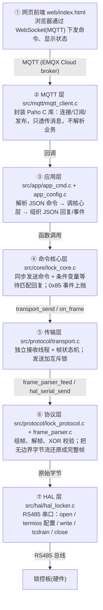

# 基于 i.MX6ULL 的智能储物柜控制系统

设备端通过 RS485 总线与 12 路锁控板通信，经 MQTT 接入云端（如 EMQX Cloud），并提供 Web 控制面板用于远程开锁与状态查询。

[演示视频：](https://www.bilibili.com/video/BV12VeF6AEei)

https://www.bilibili.com/video/BV12VeF6AEei

## 1. 功能特性

- **RS485 串口通信**：通过 `TIOCSRS485` ioctl 自动切换收发方向，控制 12 路锁控板
- **MQTT 接入**：基于 Paho MQTT C 库，支持命令下发、结果回复与事件上报
- **命令支持**：`open`（开单锁）、`status`（查单锁）、`open_all`（全开）、`read_all`（查全部）
- **主动事件上报**：锁控板门状态变化（`0x85` 帧）实时推送到云端
- **心跳上报**：每 30 秒读取并上报全量锁状态
- **Web 控制面板**：浏览器端 12 路锁卡片，开锁 / 查询 / 状态同步（MQTT over WebSocket）

## 2. 目录结构

```
locker_project/
├── CMakeLists.txt                      # 交叉编译构建脚本
├── include/                            # 对外头文件（各层公共接口）
│   ├── lock_core.h                     # 锁命令核心层接口
│   ├── hal_locker.h                    # 串口 HAL 层接口
│   ├── transport.h                     # 传输层（接收线程）接口
│   ├── frame_parser.h                  # 帧同步状态机接口
│   └── lock_protocol.h                 # 组帧/解帧协议接口
├── src/
│   ├── main/locker_agent.c             # 程序入口：初始化各模块 + 心跳主循环
│   ├── app/                            # 应用层
│   │   ├── app_config.{h,c}            # 解析 config/locker_config.json
│   │   └── app_cmd.{h,c}               # MQTT ↔ 锁核心 粘合层（命令分发/回复）
│   ├── mqtt/mqtt_client.{h,c}          # Paho MQTT 封装（生命周期管理）
│   ├── core/lock_core.c                # 锁命令核心层（同步命令 + 事件回调）
│   ├── hal/hal_locker.c                # RS485 串口初始化 / 发送
│   └── protocol/                       # 协议层（纯逻辑，零 I/O 依赖）
│       ├── frame_parser.c              # 帧同步状态机（帧头匹配 + XOR 校验）
│       ├── lock_protocol.c             # 组帧 / 解帧
│       └── transport.c                 # 串口接收线程 + 发送
├── config/locker_config.json.example   # 设备端配置模板
└── web/                                # Web 控制面板（前端）
    ├── index.html                      # 控制面板页面
    ├── mqttws31.js                     # Paho MQTT JavaScript 客户端库
    └── config.js.example               # 前端 MQTT 配置模板
```

## 3. 软件架构

系统采用分层设计，从上到下依次是：



### 关键设计：统一接收线程

旧实现中，命令函数使用 `select + read` 同步读取固定字节，会与接收线程争抢同一个串口 fd，且 `0x85` 主动上报帧（门状态变化时锁控板主动发送）无人消费、堆积在缓冲区，污染后续命令回复，导致 `read failed` 或事件丢失。

当前实现把所有串口接收统一交给 `transport` 接收线程 + `frame_parser` 状态机：

1. 命令发出后，`lock_core` 在条件变量上阻塞等待「命令码匹配」的回复帧；
2. `0x85` 事件帧则在接收线程里直接通过回调上抛，实时消费，不再堆积。

## 4. 通信协议

### 帧格式

| 偏移 | 长度 | 含义                                       |
| ---- | ---- | ------------------------------------------ |
| 0    | 4    | 帧头 `0x57 0x4B 0x4C 0x59`（ASCII "WKLY"） |
| 4    | 1    | 帧总长度（含帧头与校验字节）               |
| 5    | 1    | 锁控板地址（默认 `0x01`）                  |
| 6    | 1    | 命令码                                     |
| 7~   | n    | 数据域（可变长）                           |
| 末位 | 1    | XOR 校验（前面所有字节的异或）             |

### 命令码

| 命令码 | 含义                             |
| ------ | -------------------------------- |
| `0x82` | 开单锁                           |
| `0x83` | 读单锁状态                       |
| `0x84` | 读全部锁状态                     |
| `0x85` | 锁控板主动上报门状态变化（事件） |
| `0x86` | 开全部锁                         |

### 帧长

| 帧类型               | 长度（字节）                  |
| -------------------- | ----------------------------- |
| 开单锁 / 读单锁 请求 | 9                             |
| 开全部 / 读全部 请求 | 8                             |
| 单锁指令 回复        | 11                            |
| 开全部 回复          | 9                             |
| 读全部 回复          | `10 + 锁数量`（12 路板为 22） |

### 锁状态

| 值     | 含义 |
| ------ | ---- |
| `0x00` | 关   |
| `0x01` | 开   |

## 5. MQTT 主题与消息

设备 ID 为 `locker001`，主题前缀为 `locker/locker001/`。

| 主题                     | 方向        | 说明                          |
| ------------------------ | ----------- | ----------------------------- |
| `locker/locker001/cmd`   | 云端 → 设备 | 下发命令                      |
| `locker/locker001/reply` | 设备 → 云端 | 命令执行结果                  |
| `locker/locker001/event` | 设备 → 云端 | 心跳全量状态 / 门状态变化事件 |

### 下发命令格式（`cmd` 主题）

```json
{ "cmd": "open", "box": 3, "id": 1001 }
```

- `open` / `status`：需要 `box` 字段（1~12）
- `open_all` / `read_all`：无需 `box`
- `id` 用于关联回复（也可用 `ts` 时间戳字段，两者皆缺省时后端自动填时间戳）

### 回复格式（`reply` 主题）

单锁状态查询成功：

```json
{ "id": 1001, "code": 0, "msg": "success", "box": 3, "data": { "status": 1 } }
```

读取全部锁状态成功：

```json
{
  "id": 1002,
  "code": 0,
  "msg": "success",
  "data": { "boxes": [ { "id": 1, "status": 0 }, { "id": 2, "status": 1 } ] }
}
```

失败时 `code` 为 `-1`，`msg` 说明原因。

### 事件格式（`event` 主题）

心跳全量状态：

```json
{ "event": "heartbeat", "boxes": [ { "id": 1, "status": 0 }, { "id": 2, "status": 1 } ] }
```

门状态变化（`0x85` 主动上报）：

```json
{ "event": "lock_change", "box": 3, "status": 1 }
```

## 6. 快速开始

### 1. 依赖

- **交叉编译工具链**：`arm-buildroot-linux-gnueabihf-gcc`
- **Paho MQTT C 库**（`paho-mqtt3c`）与 **cJSON**：需预置于交叉编译根目录 `~/paho-imx6ull-rootfs` 的 `usr/include` 与 `usr/lib`
- `cmake >= 3.10`

> 构建脚本中 `SYSROOT` 与编译器已在 `CMakeLists.txt` 中硬编码，如环境不同请按需修改。

### 2. 配置

**设备端**：复制配置模板并填写实际值：

```bash
cp config/locker_config.json.example config/locker_config.json
{
    "mqtt": {
        "broker": "YOUR_BROKER_ADDRESS",
        "port": 1883,
        "username": "YOUR_USERNAME",
        "password": "YOUR_PASSWORD",
        "client_id": "locker001"
    },
    "serial": {
        "device": "/dev/ttymxc2",
        "baudrate": 9600,
        "timeout_ms": 500
    },
    "locker": {
        "board_addr": 1,
        "box_count": 12
    }
}
```

**前端**：复制前端配置模板：

```bash
cp web/config.js.example web/config.js
const MQTT_CONFIG = {
    broker: 'YOUR_BROKER_ADDRESS',
    port: 8084,                    // WSS 端口
    username: 'YOUR_USERNAME',
    password: 'YOUR_PASSWORD',
    clientIdPrefix: 'web_'
};
```

### 3. 编译

```bash
cd locker_project
cmake -B build
cmake --build build
```

产物为 `build/locker_agent`。

### 4. 运行

将可执行文件与 `config/locker_config.json` 一同部署到目标板，确保 `config/` 与可执行文件相对路径一致，然后运行：

```bash
./locker_agent
```

程序启动流程：加载配置 → 初始化 RS485 串口 → 初始化 MQTT → 初始化锁核心层（启动接收线程）→ 连接 broker → 订阅命令主题 → 进入心跳主循环。`Ctrl+C` 或 `SIGTERM` 可优雅退出。

### 5. Web 控制面板

`web/` 目录为纯静态页面，通过 MQTT over WebSocket（WSS，端口 8084/8884）直连 broker。将 `index.html`、`mqttws31.js`、`config.js` 三个文件放在同一目录，用浏览器打开 `index.html` 即可。

面板功能：

- 12 路锁卡片，实时显示每把锁的「开 / 关 / 未知」状态
- 每把锁「开锁」「查询」按钮
- 顶部连接状态徽章与「刷新」按钮（一次 `read_all` 拉取全量状态）
- MQTT 断线自动重连（10 秒间隔）

## 7. 依赖库

| 库                                                    | 用途                                |
| ----------------------------------------------------- | ----------------------------------- |
| [Paho MQTT C](https://github.com/eclipse/paho.mqtt.c) | 设备端 MQTT 客户端（`paho-mqtt3c`） |
| [cJSON](https://github.com/DaveGamble/cJSON)          | JSON 配置解析与消息组装             |
| pthread                                               | 接收线程、条件变量同步              |
| Paho MQTT JavaScript（`mqttws31.js`）                 | 前端 MQTT over WebSocket 客户端     |

## 8. 已知限制与注意事项

- **单板单实例**：`lock_core` 使用全局静态状态（互斥锁、条件变量、缓冲区），同一进程仅支持一块锁控板。
- **锁数量上限**：`lock_core` 层硬编码锁号上限为 12（`box_id > 12` 直接返回错误），扩展路数需同步修改 `lock_core.c`、`web/index.html` 的 `BOX_COUNT` 及配置 `box_count`。
- **RS485 方向切换**：`hal_serial_send` 依赖内核 `TIOCSRS485`（`SER_RS485_ENABLED | SER_RS485_RTS_AFTER_SEND`）自动控制收发方向，代码中的 GPIO 手动拉高/拉低仍为注释占位；若目标板未启用该 ioctl，需自行实现 GPIO 切换。
- **帧校验回退策略**：`frame_parser` 在 XOR 校验失败时丢弃整帧并重同步，不回溯扫描被丢弃字节内可能藏着的帧头（触发前提是总线碰撞恰好伪造出合法帧头 + 长度，概率可忽略；上层有命令超时重试兜底）。
- **配置路径**：设备端配置文件路径 `config/locker_config.json` 为相对路径，运行时需保持工作目录正确。